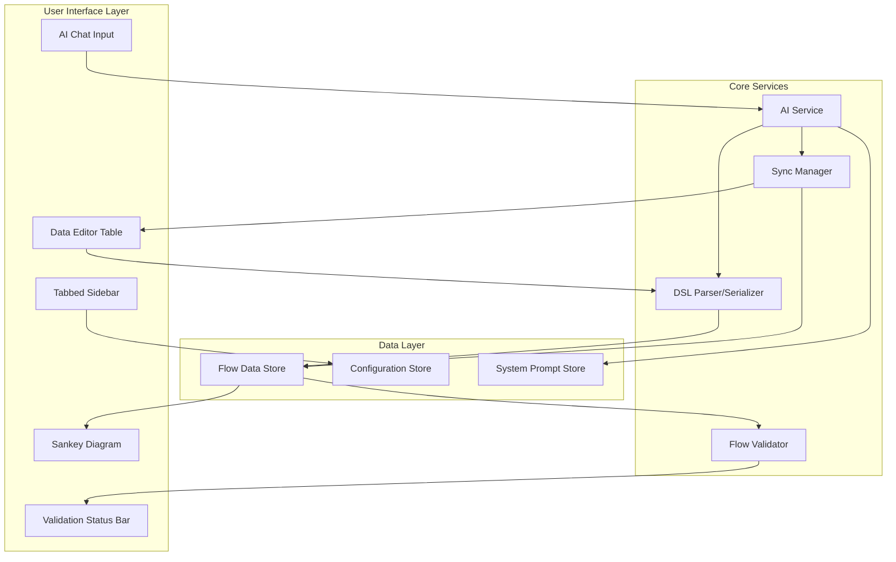

# Design Document: AI Integration and Sidebar Redesign

## Overview

This design document outlines the architecture and implementation approach for transforming the SankeyMATIC application into an AI-powered financial visualization tool with a redesigned sidebar interface. The solution integrates an AI assistant capable of parsing financial data from images and text, while reorganizing the UI into a clean, tabbed split-pane layout optimized for financial analysts.

The design follows a modular architecture that separates concerns between:
- AI processing and financial data interpretation
- Data synchronization between UI components
- Sidebar UI state management and rendering
- DSL parsing and serialization

## Architecture



## Components and Interfaces

### 1. AI Service Module (`ai_service.js`)

Handles all AI-related operations including image processing, text parsing, and financial data interpretation.

```typescript
interface AIService {
  // Initialize with system prompt
  initialize(systemPrompt: string): Promise<void>;
  
  // Process text input for financial data
  parseFinancialText(text: string): Promise<ParsedFinancialData>;
  
  // Process image input (screenshot/upload)
  parseFinancialImage(imageData: Blob | string): Promise<ParsedFinancialData>;
  
  // Get current context from Data Editor
  setContext(flows: FlowRow[]): void;
  
  // Generate DSL from parsed data
  generateDSL(data: ParsedFinancialData): string;
}

interface ParsedFinancialData {
  flows: FinancialFlow[];
  metadata: {
    documentType: 'income_statement' | 'cash_flow' | 'balance_sheet' | 'custom';
    period: string;
    comparisonPeriod?: string;
  };
  suggestedColors: Map<string, string>;
}

interface FinancialFlow {
  source: string;
  target: string;
  amount: number;
  comparisonAmount?: number;
  category: 'revenue' | 'expense' | 'asset' | 'liability' | 'profit';
  color?: string;
}
```

### 2. Sync Manager Module (`sync_manager.js`)

Manages bidirectional synchronization between AI chat, Data Editor, and diagram.

```typescript
interface SyncManager {
  // Register components for sync
  registerDataEditor(editor: DataEditorUI): void;
  registerAIChat(chat: AIChatUI): void;
  
  // Sync from AI to Data Editor
  syncFromAI(flows: FinancialFlow[]): void;
  
  // Sync from Data Editor to AI context
  syncToAI(): FlowRow[];
  
  // Highlight rows affected by AI suggestions
  highlightRows(rowIds: string[]): void;
  
  // Subscribe to sync events
  onSync(callback: (source: 'ai' | 'editor', data: FlowRow[]) => void): void;
}
```

### 3. DSL Parser/Serializer Module (`dsl_parser.js`)

Handles conversion between DSL text format and structured data.

```typescript
interface DSLParser {
  // Parse DSL text to flow rows
  parse(dslText: string): FlowRow[];
  
  // Serialize flow rows to DSL text
  serialize(flows: FlowRow[]): string;
  
  // Validate DSL syntax
  validate(dslText: string): ValidationResult;
}

interface FlowRow {
  id: string;
  source: string;
  target: string;
  amount: string | number;
  comparison?: number;
  color?: string;
  isValid: boolean;
  errors: string[];
}

interface ValidationResult {
  isValid: boolean;
  errors: SyntaxError[];
}
```

### 4. Flow Validator Module (`flow_validator.js`)

Validates that Sankey diagram flows are balanced.

```typescript
interface FlowValidator {
  // Check if all intermediate nodes are balanced
  validateBalance(flows: FlowRow[]): BalanceResult;
  
  // Get node statistics
  getNodeStats(flows: FlowRow[]): Map<string, NodeStats>;
}

interface BalanceResult {
  isBalanced: boolean;
  imbalancedNodes: ImbalancedNode[];
}

interface ImbalancedNode {
  name: string;
  totalIn: number;
  totalOut: number;
  difference: number;
}

interface NodeStats {
  totalIn: number;
  totalOut: number;
  isSource: boolean;  // No inputs
  isSink: boolean;    // No outputs
}
```

### 5. Tabbed Sidebar Component (`tabbed_sidebar.js`)

Manages the collapsible tabbed interface for sidebar controls.

```typescript
interface TabbedSidebar {
  // Initialize with tab configuration
  initialize(tabs: TabConfig[]): void;
  
  // Expand a specific tab
  expandTab(tabId: string): void;
  
  // Collapse a specific tab
  collapseTab(tabId: string): void;
  
  // Toggle tab state
  toggleTab(tabId: string): void;
  
  // Get current tab states
  getTabStates(): Map<string, boolean>;
}

interface TabConfig {
  id: string;
  title: string;
  icon?: string;
  content: HTMLElement;
  defaultExpanded: boolean;
}
```

### 6. AI Chat UI Component (`ai_chat_ui.js`)

Renders and manages the AI chat interface within the Data Editor panel.

```typescript
interface AIChatUI {
  // Render chat interface
  render(container: HTMLElement): void;
  
  // Handle image paste
  onImagePaste(callback: (imageData: Blob) => void): void;
  
  // Handle file upload
  onFileUpload(callback: (file: File) => void): void;
  
  // Show loading state
  setLoading(isLoading: boolean): void;
  
  // Display result or error
  showResult(result: AIResult): void;
  showError(error: string): void;
}

interface AIResult {
  type: 'flows' | 'message';
  flows?: FinancialFlow[];
  message?: string;
}
```

## Data Models

### Financial Flow Data Structure

```typescript
// Core flow representation
interface SankeyFlow {
  id: string;
  source: string;
  target: string;
  value: number;
  comparisonValue?: number;
  color?: string;
  metadata?: {
    category: FinancialCategory;
    yoyGrowth?: number;
  };
}

type FinancialCategory = 'revenue' | 'expense' | 'asset' | 'liability' | 'profit';

// Semantic color mapping
const SEMANTIC_COLORS: Record<FinancialCategory, string> = {
  revenue: '#888888',    // Grey - neutral inputs
  expense: '#E15549',    // Red - outflows
  asset: '#888888',      // Grey - neutral
  liability: '#E15549',  // Red - outflows
  profit: '#00AA00',     // Green - retained value
};
```

### System Prompt Configuration

```typescript
interface SystemPromptConfig {
  basePrompt: string;
  financialTerms: string[];
  flowGenerationRules: string[];
  outputFormat: string;
}

const DEFAULT_FINANCIAL_PROMPT: SystemPromptConfig = {
  basePrompt: `You are a financial data parsing assistant for Sankey diagram generation.
Your role is to interpret financial statements and convert them into flow data.`,
  
  financialTerms: [
    'Revenue', 'Sales', 'Income', 'COGS', 'Cost of Revenue',
    'Gross Profit', 'Operating Expenses', 'OPEX', 'SG&A',
    'Operating Income', 'EBIT', 'EBITDA', 'Interest', 'Tax',
    'Net Income', 'Net Profit', 'Assets', 'Liabilities', 'Equity'
  ],
  
  flowGenerationRules: [
    'Revenue sources flow INTO a Revenue aggregation node',
    'Revenue flows to Gross Profit and Cost of Revenue',
    'Gross Profit flows to Operating Profit and Operating Expenses',
    'Operating Profit flows to Net Profit and Tax',
    'Ensure all intermediate nodes balance (inputs = outputs)'
  ],
  
  outputFormat: `Output flows in this exact format:
Source [Amount] Target
Include comparison amounts as: Source [Current|Comparison] Target`
};
```

### Tab State Model

```typescript
interface TabState {
  id: string;
  isExpanded: boolean;
  animationDuration: number; // 200-400ms
}

interface SidebarState {
  tabs: TabState[];
  activeTab: string | null;
}
```


## Correctness Properties

*A property is a characteristic or behavior that should hold true across all valid executions of a system-essentially, a formal statement about what the system should do. Properties serve as the bridge between human-readable specifications and machine-verifiable correctness guarantees.*

Based on the acceptance criteria analysis, the following correctness properties must be validated through property-based testing:

### Property 1: DSL Round-Trip Consistency

*For any* valid array of FlowRow objects, serializing to DSL text and then parsing back should produce an equivalent array of FlowRow objects (with matching source, target, amount, and color values).

**Validates: Requirements 1.4, 4.4, 4.5**

### Property 2: YoY Growth Calculation Accuracy

*For any* pair of current and comparison numeric values where comparison is non-zero, the calculated YoY growth percentage should equal `((current - comparison) / comparison) * 100`.

**Validates: Requirements 2.5**

### Property 3: File Type Validation

*For any* file with a MIME type, the upload validator should accept only PNG, JPG, JPEG image types and PDF documents, rejecting all other file types.

**Validates: Requirements 1.2**

### Property 4: Semantic Color Mapping

*For any* financial category (revenue, expense, asset, liability, profit), the color mapper should return the correct semantic color (grey for revenue/asset, red for expense/liability, green for profit).

**Validates: Requirements 4.1**

### Property 5: Node Label Completeness

*For any* node with name, value, and optional YoY growth data, the generated label string should contain the node name, formatted absolute value, and YoY percentage when comparison data exists.

**Validates: Requirements 4.2**

### Property 6: Flow Balance Validation

*For any* set of flows, the balance validator should correctly identify intermediate nodes (nodes with both inputs and outputs) as balanced when total inputs equal total outputs, and as imbalanced otherwise.

**Validates: Requirements 4.3, 7.1, 7.2**

### Property 7: Sync Preserves User Data

*For any* FlowRow with user-defined color and formatting, after synchronization through the SyncManager, the color and formatting fields should remain unchanged.

**Validates: Requirements 3.4**

### Property 8: Tab Accordion Behavior

*For any* set of tabs, when one tab is expanded, all other tabs should be in collapsed state, and the expanded tab's content should be visible while collapsed tabs show only headers.

**Validates: Requirements 5.2, 5.5**

### Property 9: Data Editor Sync to AI Context

*For any* modification to Data Editor rows, the SyncManager should provide the complete updated row data to the AI context without data loss.

**Validates: Requirements 3.2**

### Property 10: System Prompt Configuration Completeness

*For any* configured system prompt, it should contain all required financial terms from the terminology list and all flow generation rules.

**Validates: Requirements 8.2, 8.3**

### Property 11: Loading State UI Consistency

*For any* loading state change (true/false), the AI chat UI should display the loading indicator when loading is true and hide it when loading is false.

**Validates: Requirements 6.3**

### Property 12: Image Paste Preview Generation

*For any* valid image blob pasted into the AI chat, a preview thumbnail element should be created and added to the preview container.

**Validates: Requirements 1.1**

### Property 13: Row Highlight Correctness

*For any* set of row IDs provided to the highlight function, exactly those rows should receive the highlight styling class, and no other rows should be highlighted.

**Validates: Requirements 3.3**

### Property 14: AI Result Display

*For any* successful AI result containing flows, the result should either be displayed inline or trigger a Data Editor update with the flow data.

**Validates: Requirements 6.4**

## Error Handling

### AI Service Errors

| Error Type | Handling Strategy | User Message |
|------------|-------------------|--------------|
| Image parsing failure | Log error, show user message | "Unable to parse image. Please try a clearer image or enter data manually." |
| API timeout | Retry once, then fail gracefully | "AI service is taking longer than expected. Please try again." |
| Invalid response format | Log and reject, prompt retry | "Received unexpected response. Please try rephrasing your request." |
| Rate limiting | Queue request, show wait indicator | "Processing... Please wait a moment." |

### Data Validation Errors

| Error Type | Handling Strategy | User Message |
|------------|-------------------|--------------|
| Invalid DSL syntax | Highlight error line, show details | "Syntax error on line X: [specific error]" |
| Imbalanced flows | Show warning, allow proceed | "Warning: Node 'X' has imbalanced flows (in: Y, out: Z)" |
| Missing required fields | Prevent save, highlight field | "Required field missing: [field name]" |
| Invalid amount format | Reject input, show format hint | "Amount must be a positive number or '*'" |

### Sync Errors

| Error Type | Handling Strategy | User Message |
|------------|-------------------|--------------|
| Sync conflict | Prefer most recent change | "Data was updated. Showing latest version." |
| Sync timeout | Retry with exponential backoff | (Silent retry, no user message unless persistent) |

## Testing Strategy

### Property-Based Testing Framework

The implementation will use **fast-check** (already in devDependencies) for property-based testing. Each correctness property will be implemented as a property-based test with a minimum of 100 iterations.

### Test File Organization

```
build/__tests__/
├── ai_service.test.js       # AI service unit tests
├── ai_service.property.js   # Property tests for AI data handling
├── dsl_parser.test.js       # DSL parser unit tests
├── dsl_parser.property.js   # Property tests for DSL round-trip
├── flow_validator.test.js   # Validator unit tests
├── flow_validator.property.js # Property tests for balance validation
├── sync_manager.test.js     # Sync manager unit tests
├── sync_manager.property.js # Property tests for sync preservation
├── tabbed_sidebar.test.js   # Sidebar UI unit tests
├── tabbed_sidebar.property.js # Property tests for tab behavior
└── ai_chat_ui.test.js       # AI chat UI unit tests
```

### Unit Testing Approach

Unit tests will cover:
- Specific examples demonstrating correct behavior
- Edge cases (empty inputs, boundary values)
- Error conditions and error message formatting
- Integration points between components

### Property-Based Testing Approach

Property tests will:
- Generate random valid inputs using fast-check arbitraries
- Verify universal properties hold across all generated inputs
- Use custom generators for domain-specific types (FlowRow, FinancialCategory, etc.)
- Run minimum 100 iterations per property
- Tag each test with the property number and requirement reference

Example property test annotation format:
```javascript
/**
 * Feature: ai-integration-sidebar-redesign, Property 1: DSL Round-Trip Consistency
 * Validates: Requirements 1.4, 4.4, 4.5
 */
```

### Test Data Generators

```javascript
// Custom arbitraries for property testing
const flowRowArbitrary = fc.record({
  id: fc.string({ minLength: 1, maxLength: 20 }),
  source: fc.string({ minLength: 1, maxLength: 50 }).filter(s => !s.includes('[') && !s.includes(']')),
  target: fc.string({ minLength: 1, maxLength: 50 }).filter(s => !s.includes('[') && !s.includes(']')),
  amount: fc.oneof(
    fc.float({ min: 0.01, max: 1000000 }).map(n => n.toFixed(2)),
    fc.constant('*')
  ),
  comparison: fc.option(fc.float({ min: 0.01, max: 1000000 })),
  color: fc.option(fc.hexaString({ minLength: 6, maxLength: 6 }).map(s => '#' + s))
});

const financialCategoryArbitrary = fc.constantFrom(
  'revenue', 'expense', 'asset', 'liability', 'profit'
);

const tabConfigArbitrary = fc.record({
  id: fc.string({ minLength: 1, maxLength: 20 }),
  title: fc.string({ minLength: 1, maxLength: 50 }),
  defaultExpanded: fc.boolean()
});
```

### Integration Testing

Integration tests will verify:
- End-to-end flow from AI input to diagram update
- Bidirectional sync between Data Editor and AI context
- Tab state persistence across interactions
- Validation status updates on data changes
