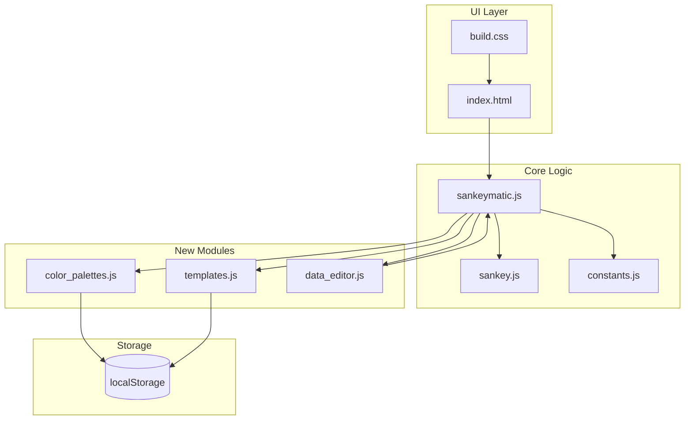

# Design Document: SankeyMATIC Refactor

## Overview

This design document outlines the architecture and implementation approach for refactoring the SankeyMATIC diagram builder application. The refactoring encompasses seven major feature areas:

1. **Layout Refactoring** - Removing SankeyMATIC-specific branding and implementing a new visual design with Manrope font and updated color palette
2. **Color Palettes Module** - A modular system for managing node color themes with custom palette support
3. **Default Palette Toggle** - User preference persistence for automatic palette selection
4. **Diagram Templates** - Save and restore visual styling configurations
5. **Draggable Labels** - Manual label positioning with d3.drag integration
6. **Label Style Enhancements** - Google Fonts integration, decimal formatting, value modes, and comparison lines
7. **Data Editor Tab** - Tabular interface with two-way sync to DSL text input

## Architecture

The application follows a modular JavaScript architecture with the following structure:

```
build/
├── index.html           # Main HTML (refactored)
├── build.css            # Styles (refactored with new color scheme)
├── sankeymatic.js       # Core diagram logic (refactored)
├── sankey.js            # D3 Sankey layout algorithm
├── constants.js         # Configuration constants
├── color_palettes.js    # NEW: Color palette management
├── templates.js         # NEW: Template management
├── data_editor.js       # NEW: Data editor functionality
└── lz-string.min.js     # URL compression library
```



## Components and Interfaces

### 1. Color Palettes Module (`color_palettes.js`)

```javascript
// Interface for palette management
const ColorPalettes = {
  // Default palettes (immutable)
  defaults: Map<string, Palette>,
  
  // Custom palettes (user-defined, persisted)
  custom: Map<string, Palette>,
  
  // Get palette by ID
  get(id: string): Palette | null,
  
  // Save custom palette
  saveCustom(name: string, colors: string[]): void,
  
  // Delete custom palette
  deleteCustom(name: string): void,
  
  // Get all palette options for dropdown
  getAllOptions(): PaletteOption[],
  
  // Get/set default palette preference
  getDefaultPalette(): string | null,
  setDefaultPalette(id: string | null): void,
  
  // Load from localStorage
  loadFromStorage(): void,
  
  // Get color for node index
  getColorForIndex(paletteId: string, index: number): string
};

interface Palette {
  id: string;
  name: string;
  colors: string[];
  isCustom: boolean;
}

interface PaletteOption {
  id: string;
  name: string;
  isCustom: boolean;
}
```

### 2. Templates Module (`templates.js`)

```javascript
// Interface for template management
const Templates = {
  // Saved templates (persisted)
  templates: Map<string, Template>,
  
  // Save current settings as template
  save(name: string): Template,
  
  // Apply template to current settings
  apply(name: string): void,
  
  // Delete template
  delete(name: string): void,
  
  // Get all templates
  getAll(): Template[],
  
  // Load from localStorage
  loadFromStorage(): void,
  
  // Extract current settings (excludes flow data)
  captureCurrentSettings(): TemplateSettings
};

interface Template {
  name: string;
  createdAt: string;
  settings: TemplateSettings;
}

interface TemplateSettings {
  // Canvas settings
  size_w: number;
  size_h: number;
  margin_l: number;
  margin_r: number;
  margin_t: number;
  margin_b: number;
  bg_color: string;
  bg_transparent: boolean;
  
  // Node settings
  node_w: number;
  node_h: number;
  node_spacing: number;
  node_border: number;
  node_theme: string;
  node_color: string;
  node_opacity: number;
  
  // Flow settings
  flow_curvature: number;
  flow_inheritfrom: string;
  flow_color: string;
  flow_opacity: number;
  
  // Label settings
  labels_fontface: string;
  labels_googlefont: string;
  labelname_size: number;
  labelname_weight: number;
  labelvalue_appears: boolean;
  labelvalue_position: string;
  labels_decimalplaces: string;
  labels_valuemode: string;
  labels_comparisonline: boolean;
  // ... other label settings
}
```

### 3. Data Editor Module (`data_editor.js`)

```javascript
// Interface for data editor
const DataEditor = {
  // Current table data
  rows: FlowRow[],
  
  // Parse DSL text to table rows
  parseFromDSL(dslText: string): FlowRow[],
  
  // Serialize table rows to DSL text
  toDSL(rows: FlowRow[]): string,
  
  // Validate a row
  validateRow(row: FlowRow): ValidationResult,
  
  // Export to CSV
  exportCSV(): string,
  
  // Import from CSV
  importCSV(csvText: string): FlowRow[],
  
  // Render table UI
  render(container: HTMLElement): void,
  
  // Sync handlers
  onTableChange: (rows: FlowRow[]) => void,
  onTextChange: (dslText: string) => void
};

interface FlowRow {
  id: string;
  source: string;
  target: string;
  amount: number | string;
  comparison?: number;
  color?: string;
  isValid: boolean;
  errors: string[];
}

interface ValidationResult {
  isValid: boolean;
  errors: string[];
}
```

### 4. Label Rendering Enhancements

The label rendering in `sankeymatic.js` will be refactored to:

```javascript
// Label group structure
<g class="label-group" transform="translate(x, y)">
  <rect class="drag-handle" fill="transparent" />
  <rect class="label-highlight" />
  <text class="label-name">Node Name</text>
  <text class="label-value">1,234</text>
  <text class="label-comparison">12.5%</text>  <!-- optional -->
</g>

// Drag behavior
const labelDrag = d3.drag()
  .on('start', onDragStart)
  .on('drag', onDrag)
  .on('end', onDragEnd);

// Label move persistence format in DSL
// labelmove NodeName 10.5, -5.2
```

## Data Models

### localStorage Keys

| Key | Type | Description |
|-----|------|-------------|
| `skm_custom_palettes` | JSON | Array of custom palette objects |
| `skm_default_palette` | string | ID of default palette |
| `skm_templates` | JSON | Array of template objects |

### DSL Extensions

New DSL line types for label positioning:

```
// Label move syntax
labelmove <NodeName> <offsetX>, <offsetY>

// Examples
labelmove Budget 15.5, -8.2
labelmove "Node With Spaces" 0, 10
```

### CSV Format for Data Editor

```csv
Source,Target,Amount,Comparison,Color
Wages,Budget,1500,,
Other,Budget,250,,
Budget,Taxes,450,,
Budget,Housing,420,,#606
```

## Correctness Properties

*A property is a characteristic or behavior that should hold true across all valid executions of a system-essentially, a formal statement about what the system should do. Properties serve as the bridge between human-readable specifications and machine-verifiable correctness guarantees.*

### Property 1: Palette Color Cycling
*For any* palette with N colors and any node at index I (without explicit color), the node SHALL receive the color at index (I % N) from the palette.
**Validates: Requirements 2.3, 2.8, 2.9**

### Property 2: Custom Palette Round-Trip
*For any* valid custom palette (name and array of hex colors), saving the palette and then retrieving it SHALL return an equivalent palette object.
**Validates: Requirements 2.6, 2.7**

### Property 3: Default Palette Preference Round-Trip
*For any* palette ID, setting it as default and then querying the default preference SHALL return the same palette ID.
**Validates: Requirements 3.2, 3.3, 3.4**

### Property 4: Template Persistence Round-Trip
*For any* valid template (name and settings object), saving the template and then retrieving it SHALL return an equivalent template object.
**Validates: Requirements 4.5, 4.9**

### Property 5: Template Application Round-Trip
*For any* saved template, applying it to the UI and then capturing current settings SHALL produce settings equivalent to the original template.
**Validates: Requirements 4.3, 4.6**

### Property 6: Template Flow Data Invariant
*For any* template save or apply operation, the flow data (source, target, amount values in the DSL) SHALL remain unchanged.
**Validates: Requirements 4.4, 4.7**

### Property 7: Label SVG Structure
*For any* rendered diagram with N nodes, there SHALL be exactly N label groups, each containing a g element with transform attribute and a transparent drag-handle rect.
**Validates: Requirements 5.1, 5.2**

### Property 8: Label Move Round-Trip
*For any* label move operation with offset (X, Y), the resulting DSL SHALL contain a labelmove line, and parsing that DSL SHALL position the label at offset (X, Y).
**Validates: Requirements 5.4, 5.5**

### Property 9: Font Application
*For any* Google Font selection, all rendered label text elements SHALL have font-family including the selected font name.
**Validates: Requirements 6.2**

### Property 10: Decimal Places Formatting
*For any* number N and decimal places setting D (0, 1, 2, or All), the formatted output SHALL have exactly D decimal places (or the natural precision for "All").
**Validates: Requirements 6.4**

### Property 11: Short Scale Formatting
*For any* number N >= 1000, short scale formatting SHALL produce a string with the appropriate suffix (k for thousands, M for millions, B for billions) and a value that when parsed equals N within rounding tolerance.
**Validates: Requirements 6.6**

### Property 12: Comparison Line Percentage
*For any* node with value V in a diagram with total input T, the comparison line SHALL display a percentage equal to (V / T) * 100, rounded appropriately.
**Validates: Requirements 6.8**

### Property 13: DSL-Table Two-Way Sync
*For any* valid DSL text, parsing to table rows and serializing back to DSL SHALL produce semantically equivalent DSL (same flows, possibly different formatting).
**Validates: Requirements 7.4, 7.5, 7.6, 7.7, 7.11**

### Property 14: CSV Round-Trip
*For any* valid flow data, exporting to CSV and importing that CSV SHALL produce equivalent flow data.
**Validates: Requirements 7.8, 7.9**

### Property 15: Invalid Row Highlighting
*For any* table row with invalid data (empty source, empty target, non-numeric amount, or negative amount), the row SHALL have visual error highlighting applied.
**Validates: Requirements 7.10**

## Error Handling

### Color Palettes
- Invalid hex colors in custom palettes: Reject with validation error, do not save
- Missing palette ID: Fall back to first default palette (Categories)
- Corrupted localStorage: Reset to defaults, log warning

### Templates
- Invalid template structure: Skip loading, log warning
- Missing settings in template: Use current defaults for missing values
- Template name collision: Overwrite existing template with confirmation

### Data Editor
- Invalid DSL syntax: Mark row as invalid, highlight in red
- CSV parsing errors: Show error message, reject import
- Empty required fields: Highlight cell, prevent sync until fixed

### Label Dragging
- Drag outside canvas bounds: Clamp to canvas edges
- Invalid labelmove syntax in DSL: Ignore line, log warning

## Testing Strategy

### Unit Testing Framework
- **Framework**: Vitest (fast, ESM-native, compatible with existing setup)
- **Location**: `build/__tests__/` directory

### Property-Based Testing Framework
- **Framework**: fast-check (JavaScript property-based testing library)
- **Configuration**: Minimum 100 iterations per property test
- **Location**: `build/__tests__/properties/` directory

### Test Categories

#### Unit Tests
1. **Color Palettes**
   - Palette loading and initialization
   - Custom palette CRUD operations
   - localStorage integration

2. **Templates**
   - Template save/load operations
   - Settings capture accuracy
   - Flow data isolation

3. **Data Editor**
   - DSL parsing edge cases
   - CSV generation/parsing
   - Row validation logic

4. **Label Rendering**
   - SVG structure generation
   - Drag offset calculations
   - labelmove line parsing

#### Property-Based Tests
Each correctness property (1-15) will have a corresponding property-based test tagged with:
```javascript
// **Feature: sankey-refactor, Property 1: Palette Color Cycling**
// **Validates: Requirements 2.3, 2.8, 2.9**
```

#### Integration Tests
1. Full render cycle with custom palette
2. Template save → close → reopen → apply flow
3. Data Editor ↔ Text Input sync during editing
4. Label drag → save → reload → verify position

### Test Data Generators (fast-check)
- `arbPalette`: Generate valid palette objects
- `arbTemplate`: Generate valid template objects
- `arbFlowRow`: Generate valid/invalid flow rows
- `arbDSL`: Generate valid DSL text
- `arbCSV`: Generate valid CSV content
- `arbLabelOffset`: Generate valid (x, y) offset pairs
- `arbHexColor`: Generate valid hex color strings
