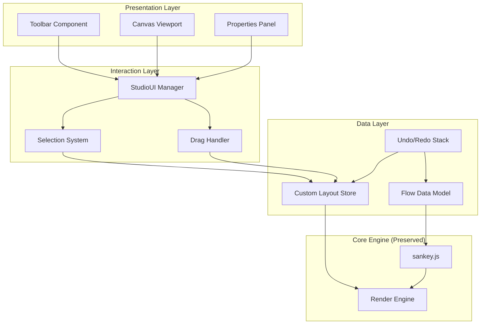

# Design Document: Sankey Studio Canvas Refactor

## Overview

This design transforms the existing SankeyMATIC application into a professional "Sankey Studio" with a canvas-first experience. The refactor introduces an infinite canvas viewport system, a centralized interaction state manager (StudioUI), and a three-panel layout architecture while preserving the core sankey.js calculation engine.

The design follows a layered architecture where the existing rendering logic is wrapped with new viewport and interaction systems, ensuring backward compatibility while enabling modern diagramming tool interactions.

## Architecture



## Components and Interfaces

### 1. StudioUI Manager

The central state management object that coordinates all interactions.

```javascript
/**
 * StudioUI - Central interaction state manager
 * Tracks current tool, selection, and interaction mode
 */
const StudioUI = {
    // Current active tool
    currentTool: 'select', // 'select' | 'pan' | 'addNode' | 'addFlow'
    
    // Currently selected element
    selectedElement: null, // { type: 'node'|'flow'|'label'|'canvas', id: string, element: SVGElement }
    
    // Current interaction mode
    interactionMode: 'idle', // 'idle' | 'dragging' | 'panning' | 'selecting'
    
    // Viewport transform state
    viewport: {
        x: 0,
        y: 0,
        scale: 1
    },
    
    // Methods
    setTool(tool: string): void,
    select(element: SelectableElement | null): void,
    startInteraction(mode: string): void,
    endInteraction(): void,
    updateViewport(transform: ViewportTransform): void,
    
    // Event emitter for state changes
    on(event: string, callback: Function): void,
    emit(event: string, data: any): void
};
```

### 2. Viewport System

Wraps the SVG diagram in a transformable container with pan/zoom capabilities.

```javascript
/**
 * ViewportController - Manages infinite canvas behavior
 */
interface ViewportController {
    // Initialize viewport on SVG element
    init(svgElement: SVGElement): void;
    
    // Pan the viewport by delta
    pan(dx: number, dy: number): void;
    
    // Zoom centered on a point
    zoom(scale: number, centerX: number, centerY: number): void;
    
    // Fit diagram to screen
    fitToScreen(): void;
    
    // Reset to default view
    reset(): void;
    
    // Get current transform
    getTransform(): { x: number, y: number, scale: number };
    
    // Convert screen coords to diagram coords
    screenToDiagram(screenX: number, screenY: number): { x: number, y: number };
}
```

### 3. Selection System

Manages visual selection feedback and element identification.

```javascript
/**
 * SelectionManager - Handles element selection and visual feedback
 */
interface SelectionManager {
    // Select an element
    select(element: SVGElement, type: 'node' | 'flow' | 'label'): void;
    
    // Deselect current selection
    deselect(): void;
    
    // Get currently selected element info
    getSelection(): SelectionInfo | null;
    
    // Apply visual selection effect
    applySelectionStyle(element: SVGElement, type: string): void;
    
    // Remove visual selection effect
    removeSelectionStyle(element: SVGElement): void;
}

interface SelectionInfo {
    type: 'node' | 'flow' | 'label' | 'canvas';
    id: string;
    element: SVGElement;
    data: NodeData | FlowData | LabelData;
}
```

### 4. Properties Panel Controller

Dynamic sidebar that updates based on selection context.

```javascript
/**
 * PropertiesPanelController - Manages context-sensitive properties display
 */
interface PropertiesPanelController {
    // Update panel based on selection
    updateForSelection(selection: SelectionInfo | null): void;
    
    // Render canvas properties (global settings)
    renderCanvasProperties(): void;
    
    // Render node-specific properties
    renderNodeProperties(nodeData: NodeData): void;
    
    // Render flow-specific properties
    renderFlowProperties(flowData: FlowData): void;
    
    // Render label-specific properties
    renderLabelProperties(labelData: LabelData): void;
    
    // Handle property change from UI
    onPropertyChange(property: string, value: any): void;
}
```

### 5. Custom Layout Store

Stores user-defined positions for nodes and labels independently.

```javascript
/**
 * CustomLayoutStore - Persists user positioning overrides
 */
interface CustomLayoutStore {
    // Node position overrides (relative to sankey.js calculated position)
    nodePositions: Map<string, { dx: number, dy: number }>;
    
    // Label position overrides (independent from node)
    labelPositions: Map<string, { x: number, y: number }>;
    
    // Label dimensions
    labelDimensions: Map<string, { width: number, height: number }>;
    
    // Methods
    setNodePosition(nodeId: string, dx: number, dy: number): void;
    setLabelPosition(nodeId: string, x: number, y: number): void;
    setLabelDimensions(nodeId: string, width: number, height: number): void;
    
    getNodePosition(nodeId: string): { dx: number, dy: number } | null;
    getLabelPosition(nodeId: string): { x: number, y: number } | null;
    
    clearNodePosition(nodeId: string): void;
    clearLabelPosition(nodeId: string): void;
    clearAll(): void;
    
    // Serialization
    toJSON(): string;
    fromJSON(json: string): void;
}
```

### 6. Drag Handler

Manages drag interactions for nodes and labels.

```javascript
/**
 * DragHandler - Coordinates drag operations
 */
interface DragHandler {
    // Start drag operation
    startDrag(element: SVGElement, type: 'node' | 'label', startX: number, startY: number): void;
    
    // Update during drag
    updateDrag(currentX: number, currentY: number): void;
    
    // End drag operation
    endDrag(): void;
    
    // Cancel drag operation
    cancelDrag(): void;
    
    // Check if currently dragging
    isDragging(): boolean;
}
```

## Data Models

### Node Data Model

```javascript
interface NodeData {
    id: string;           // Unique identifier (node name)
    name: string;         // Display name
    x: number;            // Calculated X position (from sankey.js)
    y: number;            // Calculated Y position (from sankey.js)
    dx: number;           // Node width
    dy: number;           // Node height (calculated from flow values)
    
    // Custom styling
    fillColor: string;
    borderColor: string;
    opacity: number;
    
    // Custom position offset
    customDx: number;     // User-defined X offset
    customDy: number;     // User-defined Y offset
}
```

### Label Data Model

```javascript
interface LabelData {
    nodeId: string;       // Associated node ID
    text: string;         // Label text content
    
    // Position (independent from node)
    x: number;
    y: number;
    
    // Dimensions
    width: number;
    height: number;
    
    // Styling
    fontSize: number;
    fontColor: string;
    alignment: 'left' | 'center' | 'right';
    backgroundColor: string | null;
    backgroundEnabled: boolean;
}
```

### Flow Data Model

```javascript
interface FlowData {
    id: string;           // Unique identifier
    source: string;       // Source node name
    target: string;       // Target node name
    value: number;        // Flow amount
    
    // Styling
    color: string;
    opacity: number;
    
    // Metadata for identification
    dataSource: string;   // data-source attribute value
    dataTarget: string;   // data-target attribute value
}
```

### Viewport Transform

```javascript
interface ViewportTransform {
    x: number;            // Pan X offset
    y: number;            // Pan Y offset
    scale: number;        // Zoom scale (1.0 = 100%)
}
```

## Correctness Properties

*A property is a characteristic or behavior that should hold true across all valid executions of a system-essentially, a formal statement about what the system should do. Properties serve as the bridge between human-readable specifications and machine-verifiable correctness guarantees.*


### Property 1: Viewport Pan Preserves Content
*For any* viewport state and any pan delta (dx, dy), panning the viewport should translate all diagram elements by the same delta without modifying their relative positions to each other.
**Validates: Requirements 1.2**

### Property 2: Zoom Maintains Center Point
*For any* zoom operation with a specified center point, the diagram coordinates at that center point should remain at the same screen position after zooming.
**Validates: Requirements 1.3, 1.6**

### Property 3: Selection State Synchronization
*For any* clickable element (node, flow, or label), clicking it should update StudioUI.selectedElement to reference that element, and clicking empty canvas should set selectedElement to null.
**Validates: Requirements 2.2, 2.4, 2.5**

### Property 4: Tool State Synchronization
*For any* tool selection from the toolbar, StudioUI.currentTool should update to match the selected tool, and the canvas cursor style should change to reflect the active tool.
**Validates: Requirements 2.3, 10.5**

### Property 5: Node Position Persistence Round-Trip
*For any* node and any position offset (dx, dy), setting the node's custom position and then reading it back should return the same offset values.
**Validates: Requirements 3.1**

### Property 6: Label Position Independence
*For any* node with an associated label, moving the node should not change the label's stored position, and moving the label should not change the node's stored position.
**Validates: Requirements 3.2, 5.2, 5.3, 5.6**

### Property 7: Custom Layout Preservation on Data Change
*For any* diagram with custom node/label positions, modifying the underlying flow data should preserve all custom positions after re-rendering.
**Validates: Requirements 3.4**

### Property 8: Property Panel Synchronization
*For any* property change made in the Properties Panel, the corresponding visual element should update immediately, and the underlying data model should reflect the same value.
**Validates: Requirements 3.5**

### Property 9: Interactive Elements Pointer Events
*For any* rendered interactive element (node rect, flow path, label group), the element should have pointer-events CSS property set to a value that allows interaction (not 'none').
**Validates: Requirements 4.7**

### Property 10: Label Structure Correctness
*For any* rendered label, the DOM structure should contain a group element (`<g>`) with a background rectangle (`<rect>`) and text element (`<text>`) as children.
**Validates: Requirements 5.1**

### Property 11: Label Dimension Synchronization
*For any* label dimension change (width or height) via the Properties Panel, the label's background rectangle should resize to match the new dimensions.
**Validates: Requirements 5.5**

### Property 12: Selection Visual Feedback
*For any* selected element, a distinctive visual style (CSS class or inline style) should be applied, and upon deselection, all selection styles should be removed.
**Validates: Requirements 6.1, 6.2, 6.3, 6.4**

### Property 13: Single Selection Enforcement
*For any* selection operation when an element is already selected, the previously selected element should be deselected before the new element is selected.
**Validates: Requirements 6.5**

### Property 14: Flow Metadata Attributes
*For any* rendered flow path element, the element should have both `data-source` and `data-target` attributes containing the correct source and target node names.
**Validates: Requirements 7.1, 7.2**

### Property 15: Flow Identification Round-Trip
*For any* flow, clicking the flow path should correctly identify it using data attributes, and editing its properties should update the correct flow in the data model.
**Validates: Requirements 7.3, 7.4**

### Property 16: Sankey.js Position Source of Truth
*For any* node without custom positioning, its rendered position should exactly match the position calculated by sankey.js. For nodes with custom positioning, the rendered position should equal sankey.js position plus the custom offset.
**Validates: Requirements 8.2, 8.3**

### Property 17: Tool-Specific Behavior
*For any* tool mode, the corresponding interaction behavior should be active: Select tool enables element selection, Pan tool enables viewport panning, Add Node tool enables node creation on click, Add Flow tool enables flow creation between clicked nodes.
**Validates: Requirements 10.1, 10.2, 10.3, 10.4**

### Property 18: Undo/Redo Round-Trip
*For any* undoable action, performing the action then undoing should restore the previous state, and redoing should restore the action's result.
**Validates: Requirements 10.6, 10.7**

## Error Handling

### Viewport Errors
- **Invalid zoom level**: Clamp zoom to min/max bounds (0.1 to 5.0)
- **Pan out of bounds**: Allow unlimited panning but provide "fit to screen" recovery
- **Transform calculation errors**: Fall back to identity transform and log error

### Selection Errors
- **Click on non-existent element**: Treat as canvas click (deselect)
- **Selection of removed element**: Clear selection and update panel
- **Invalid element type**: Log warning and ignore selection

### Data Synchronization Errors
- **Invalid property value**: Validate before applying, show error in panel
- **Circular flow reference**: Prevent flow from source to same source
- **Missing node reference**: Show error message, prevent flow creation

### Drag Operation Errors
- **Drag outside viewport**: Continue drag with clamped coordinates
- **Drag conflict**: Cancel previous drag before starting new one
- **Invalid drop position**: Snap to nearest valid position

### Undo/Redo Errors
- **Empty undo stack**: Disable undo button, no-op on undo call
- **Empty redo stack**: Disable redo button, no-op on redo call
- **Corrupted state**: Clear undo stack and log error

## Testing Strategy

### Unit Tests
Unit tests will verify specific examples and edge cases for individual components:

1. **StudioUI Manager**
   - Initial state has correct default values
   - Tool switching updates currentTool
   - Selection updates selectedElement
   - Event emission on state changes

2. **Viewport Controller**
   - Pan by specific delta values
   - Zoom at specific scale factors
   - Coordinate transformation accuracy
   - Fit to screen calculation

3. **Selection Manager**
   - Apply/remove selection styles
   - Single selection enforcement
   - Selection info retrieval

4. **Custom Layout Store**
   - Set/get node positions
   - Set/get label positions
   - Clear operations
   - JSON serialization/deserialization

5. **Properties Panel**
   - Correct panel content for each selection type
   - Property change propagation

### Property-Based Tests
Property-based tests will use **fast-check** library for JavaScript to verify universal properties across many generated inputs. Each test will run a minimum of 100 iterations.

Test file structure:
```
tests/
  studio-ui.property.test.js
  viewport.property.test.js
  selection.property.test.js
  layout.property.test.js
  flow-metadata.property.test.js
```

Each property test will be tagged with:
```javascript
// Feature: sankey-studio-canvas-refactor, Property N: [property description]
```

### Integration Tests
Integration tests will verify component interactions:

1. **Selection → Properties Panel flow**
2. **Drag → Layout Store → Re-render flow**
3. **Tool selection → Interaction behavior flow**
4. **Undo/Redo → State restoration flow**

### Test Configuration
- Testing framework: Vitest (already configured in project)
- Property-based testing: fast-check
- DOM testing: jsdom environment
- Minimum property test iterations: 100
