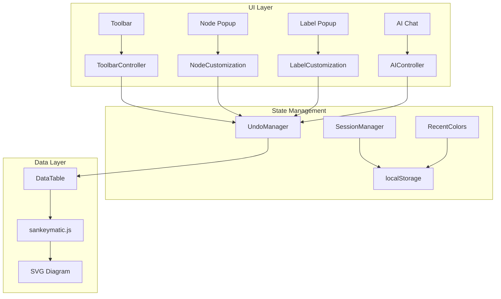

# Design Document: UI Improvements and AI Enhancement

## Overview

This design document outlines the implementation of comprehensive UI improvements for the Sankey Diagram Builder, including session management, toolbar functionality fixes, enhanced label and node customization settings, and deeper AI integration for data manipulation.

The implementation builds on the existing architecture with modular components (ToolbarController, UndoManager, SelectionManager) and extends the customization system in `index.html` and `sankeymatic.js`.

## Architecture



## Components and Interfaces

### 1. SessionManager

New module to handle session reset functionality.

```javascript
const SessionManager = {
  /**
   * Reset the entire session to default state
   * @returns {boolean} True if reset was confirmed and executed
   */
  resetSession() {
    // Show confirmation dialog
    // Clear all state: diagram data, customizations, undo history
    // Clear localStorage
    // Reset to empty canvas
  },
  
  /**
   * Clear all diagram data from the data table
   */
  clearDiagramData() {
    // Remove all rows from data-table-body
    // Clear nodeColors, nodeCustomizations, customLayout
    // Clear rememberedMoves, rememberedLabelMoves
  },
  
  /**
   * Clear all localStorage data for this application
   */
  clearLocalStorage() {
    // Remove sankeymatic-related keys from localStorage
  }
};
```

### 2. Enhanced ToolbarController

Extend existing ToolbarController with missing button handlers.

```javascript
// Additional methods for ToolbarController
{
  /**
   * Handle Reset Nodes button click
   * Clears all node position customizations
   */
  _handleResetNodes() {
    // Clear rememberedMoves
    // Clear customLayout node positions
    // Re-render diagram
  },
  
  /**
   * Handle Reset Labels button click
   * Clears all label position customizations
   */
  _handleResetLabels() {
    // Clear rememberedLabelMoves
    // Clear label customizations from nodeCustomizations
    // Re-render diagram
  },
  
  /**
   * Handle Export button with options
   */
  _handleExportWithOptions() {
    // Show export modal with PNG/SVG options
  }
}
```

### 3. RecentColorsManager

New module to track recently used colors.

```javascript
const RecentColorsManager = {
  MAX_COLORS: 5,
  STORAGE_KEY: 'sankeymatic-recent-colors',
  
  /**
   * Get the list of recent colors
   * @returns {string[]} Array of hex color codes
   */
  getRecentColors() {
    // Load from localStorage
    // Return array of up to 5 colors
  },
  
  /**
   * Add a color to the recent list (FIFO)
   * @param {string} hexColor - Hex color code
   */
  addColor(hexColor) {
    // Validate hex format
    // Add to front of list
    // Remove duplicates
    // Trim to MAX_COLORS
    // Save to localStorage
  },
  
  /**
   * Render recent colors UI in popup
   * @param {HTMLElement} container - Container element
   * @param {Function} onSelect - Callback when color is selected
   */
  renderRecentColors(container, onSelect) {
    // Create color swatches
    // Attach click handlers
  }
};
```

### 4. Enhanced Label Settings

Update Label_Settings_Popup with text margins and formatting.

```html
<!-- Updated Label Settings Popup Structure -->
<div class="node-popup-section">
  <h4>Text Margins</h4>
  <div class="margin-controls">
    <input type="number" id="popup-label-margin-top" placeholder="Top">
    <input type="number" id="popup-label-margin-right" placeholder="Right">
    <input type="number" id="popup-label-margin-bottom" placeholder="Bottom">
    <input type="number" id="popup-label-margin-left" placeholder="Left">
  </div>
</div>

<div class="node-popup-section">
  <h4>Text Formatting</h4>
  <div class="formatting-controls">
    <button id="format-bold" title="Bold">B</button>
    <button id="format-italic" title="Italic">I</button>
  </div>
  <textarea id="popup-label-text-multiline" placeholder="Multi-line text"></textarea>
</div>
```

```javascript
// Label customization data structure
const labelCustomization = {
  labelText: string,           // Display text (supports multi-line)
  labelColor: string,          // Text color hex
  labelFontSize: number,       // Font size in px
  labelAlign: 'left'|'center'|'right',
  labelBold: boolean,          // Bold formatting
  labelItalic: boolean,        // Italic formatting
  labelMarginTop: number,      // Top margin in px
  labelMarginRight: number,    // Right margin in px
  labelMarginBottom: number,   // Bottom margin in px
  labelMarginLeft: number,     // Left margin in px
  labelBgEnabled: boolean,     // Show background
  labelBg: string,             // Background color hex
  labelX: number,              // X offset from default
  labelY: number               // Y offset from default
};
```

### 5. Enhanced Node Settings

Update Node_Settings_Popup with hex input and recent colors.

```html
<!-- Updated Node Settings Popup Structure -->
<div class="node-popup-section">
  <h4>Appearance</h4>
  <div class="node-popup-row">
    <label>Fill Color</label>
    <div class="color-input-group">
      <input type="color" id="popup-node-fill">
      <input type="text" id="popup-node-fill-hex" placeholder="#RRGGBB" maxlength="7">
    </div>
  </div>
  <div class="node-popup-row">
    <label>Recent Colors</label>
    <div id="recent-colors-container" class="recent-colors"></div>
  </div>
  <div class="node-popup-row">
    <label>Border Color</label>
    <div class="color-input-group">
      <input type="color" id="popup-node-border">
      <input type="text" id="popup-node-border-hex" placeholder="#RRGGBB" maxlength="7">
    </div>
  </div>
  <div class="node-popup-row">
    <label>Border Opacity %</label>
    <input type="range" id="popup-node-border-opacity" min="0" max="100" value="100">
    <span id="popup-node-border-opacity-value">100%</span>
  </div>
</div>
```

```javascript
// Node customization data structure
const nodeCustomization = {
  fillColor: string,           // Fill color hex
  borderColor: string,         // Border color hex
  opacity: number,             // Fill opacity 0-100
  borderOpacity: number        // Border opacity 0-100 (NEW)
};
```

### 6. AIController Enhancement

Extend AI integration to read and modify diagram data.

```javascript
const AIController = {
  /**
   * Get current diagram data as JSON
   * @returns {Object} Diagram data with flows and nodes
   */
  getDiagramData() {
    // Read from data table
    // Return { flows: [...], nodes: [...] }
  },
  
  /**
   * Apply modified data from AI
   * @param {Object} newData - Modified diagram data
   * @returns {boolean} True if applied successfully
   */
  applyDiagramData(newData) {
    // Validate JSON structure
    // Record undo action
    // Update data table
    // Preserve customizations
    // Re-render diagram
  },
  
  /**
   * Convert all flow amounts by a factor
   * @param {number} factor - Multiplication factor
   * @param {string} [suffix] - Optional suffix (e.g., 'B' for billions)
   */
  convertUnits(factor, suffix) {
    // Get current data
    // Multiply all amounts
    // Apply changes
  },
  
  /**
   * Analyze and suggest flow balancing
   * @returns {Object} Analysis with imbalanced nodes and suggestions
   */
  analyzeFlowBalance() {
    // Calculate inflows and outflows per node
    // Identify imbalanced nodes
    // Generate correction suggestions
  }
};
```

## Data Models

### Session State

```javascript
// Complete session state for reset/restore
const sessionState = {
  // Diagram data
  flows: [{ from: string, to: string, amount: number }],
  
  // Node customizations
  nodeCustomizations: { [nodeName]: NodeCustomization },
  nodeColors: { [nodeName]: string },
  
  // Layout customizations
  customLayout: { [nodeName]: { dx, dy, originalX, originalY } },
  rememberedMoves: Map<string, [dx, dy]>,
  rememberedLabelMoves: Map<string, [offsetX, offsetY]>,
  
  // Undo history
  undoStack: Action[],
  redoStack: Action[],
  
  // Settings
  recentColors: string[]
};
```

### Validation Rules

```javascript
const ValidationRules = {
  hexColor: /^#[0-9A-Fa-f]{6}$/,
  opacity: { min: 0, max: 100 },
  margin: { min: 0, max: 100 },
  fontSize: { min: 8, max: 72 },
  
  /**
   * Validate and clamp a numeric value
   * @param {number} value - Input value
   * @param {Object} bounds - { min, max }
   * @returns {number} Clamped value
   */
  clampValue(value, bounds) {
    return Math.max(bounds.min, Math.min(bounds.max, value));
  },
  
  /**
   * Validate hex color format
   * @param {string} hex - Hex color string
   * @returns {boolean} True if valid
   */
  isValidHex(hex) {
    return this.hexColor.test(hex);
  }
};
```

## Correctness Properties

*A property is a characteristic or behavior that should hold true across all valid executions of a system—essentially, a formal statement about what the system should do. Properties serve as the bridge between human-readable specifications and machine-verifiable correctness guarantees.*

### Property 1: Session Reset Clears All State

*For any* session with diagram data, customizations, and undo history, when the session is reset, all state (nodeCustomizations, customLayout, rememberedMoves, rememberedLabelMoves, undoStack, redoStack, localStorage) SHALL be empty or at default values.

**Validates: Requirements 1.1, 1.3, 1.4**

### Property 2: Undo Reverts State

*For any* action recorded in the undo stack, calling undo SHALL restore the previous state exactly as it was before the action.

**Validates: Requirements 2.1**

### Property 3: Redo Restores Undone State

*For any* undone action, calling redo SHALL restore the state to exactly what it was after the original action.

**Validates: Requirements 2.2**

### Property 4: Add Node Creates Valid Node

*For any* canvas click with the Add Node tool active, a new node SHALL be created with a unique name and appear in the diagram.

**Validates: Requirements 2.4**

### Property 5: Add Flow Creates Valid Connection

*For any* two distinct nodes selected with the Add Flow tool, a flow SHALL be created connecting them with a default value.

**Validates: Requirements 2.5**

### Property 6: Reset Nodes Restores Calculated Positions

*For any* set of moved nodes, clicking Reset Nodes SHALL clear all position offsets and restore nodes to their sankey-calculated positions.

**Validates: Requirements 2.6**

### Property 7: Reset Labels Restores Default Positions

*For any* set of moved labels, clicking Reset Labels SHALL clear all label position offsets and restore labels to their default positions relative to nodes.

**Validates: Requirements 2.7**

### Property 8: Text Margins Apply Padding

*For any* label with text margins set, the rendered label background SHALL have padding equal to the specified margins on each side.

**Validates: Requirements 3.2**

### Property 9: Text Formatting Renders Correctly

*For any* label with bold and/or italic formatting, the rendered SVG text SHALL have the corresponding font-weight and font-style attributes.

**Validates: Requirements 3.6**

### Property 10: Label Settings Persistence

*For any* label with customizations, reopening the label popup SHALL display the previously saved values for all settings.

**Validates: Requirements 3.7**

### Property 11: Recent Colors FIFO Behavior

*For any* sequence of color selections, the recent colors list SHALL contain at most 5 colors in FIFO order (most recent first), with no duplicates.

**Validates: Requirements 4.2, 4.7**

### Property 12: Hex Color Input Sync

*For any* valid hex color entered in the hex input field, the color picker SHALL update to match, and vice versa.

**Validates: Requirements 4.4**

### Property 13: Border Opacity Renders Correctly

*For any* node with border opacity set, the rendered SVG rect SHALL have stroke-opacity equal to the specified percentage divided by 100.

**Validates: Requirements 4.6**

### Property 14: AI Data Access Completeness

*For any* diagram, the AI SHALL receive JSON data containing all node names, flow connections (source, target), and flow amounts.

**Validates: Requirements 5.1, 5.7**

### Property 15: AI Data Validation

*For any* AI-modified JSON, the system SHALL validate the structure before applying, rejecting invalid JSON with an error message.

**Validates: Requirements 5.2**

### Property 16: Unit Conversion Accuracy

*For any* unit conversion request with factor F, all flow amounts SHALL be multiplied by F exactly.

**Validates: Requirements 5.4**

### Property 17: AI Changes Preserve Customizations

*For any* AI data modification, all existing node customizations (colors, positions, label settings) SHALL be preserved.

**Validates: Requirements 5.8**

### Property 18: Input Validation and Clamping

*For any* numeric input outside valid bounds, the system SHALL clamp the value to the nearest valid bound.

**Validates: Requirements 6.1, 6.5**

### Property 19: Settings Persistence Round-Trip

*For any* set of customization settings saved to localStorage, refreshing the page SHALL restore those exact settings.

**Validates: Requirements 6.4**

## Error Handling

### Input Validation Errors

| Error Condition | User Feedback | System Behavior |
|----------------|---------------|-----------------|
| Invalid hex color | "Invalid color format. Use #RRGGBB" | Reject input, keep previous value |
| Opacity out of range | Silently clamp | Clamp to 0-100 |
| Margin negative | Silently clamp | Clamp to 0 |
| Empty node name | "Node name cannot be empty" | Reject, keep previous |
| Invalid JSON from AI | "Invalid data format" | Reject, show error |

### Session Reset Confirmation

```javascript
// Confirmation dialog before reset
const confirmReset = () => {
  return confirm(
    'Are you sure you want to reset the session?\n\n' +
    'This will clear:\n' +
    '• All diagram data\n' +
    '• All customizations\n' +
    '• Undo/redo history\n' +
    '• Saved progress\n\n' +
    'This action cannot be undone.'
  );
};
```

## Testing Strategy

### Unit Tests

Unit tests verify specific examples and edge cases:

- Session reset clears specific state objects
- Hex color validation accepts/rejects specific formats
- Recent colors list handles edge cases (empty, full, duplicates)
- Margin values clamp correctly at boundaries

### Property-Based Tests

Property tests verify universal properties across all inputs using fast-check:

- **Minimum 100 iterations per property test**
- Each test references its design document property
- Tag format: **Feature: ui-improvements-and-ai-enhancement, Property N: [property_text]**

```javascript
// Example property test structure
import fc from 'fast-check';

describe('RecentColorsManager', () => {
  // Feature: ui-improvements-and-ai-enhancement, Property 11: Recent Colors FIFO Behavior
  it('maintains FIFO order with max 5 colors', () => {
    fc.assert(
      fc.property(
        fc.array(fc.hexaString({ minLength: 6, maxLength: 6 }), { minLength: 1, maxLength: 20 }),
        (colors) => {
          const manager = new RecentColorsManager();
          colors.forEach(c => manager.addColor('#' + c));
          const recent = manager.getRecentColors();
          
          // Max 5 colors
          expect(recent.length).toBeLessThanOrEqual(5);
          
          // No duplicates
          expect(new Set(recent).size).toBe(recent.length);
          
          // Most recent first
          if (colors.length > 0) {
            const lastUnique = '#' + colors[colors.length - 1];
            expect(recent[0]).toBe(lastUnique);
          }
        }
      ),
      { numRuns: 100 }
    );
  });
});
```

### Integration Tests

- Toolbar button clicks trigger correct handlers
- Popup changes apply to SVG correctly
- AI modifications update diagram and undo stack
- localStorage persistence across page refresh

## Notes

- All new functionality integrates with existing UndoManager
- Recent colors persist in localStorage with key `sankeymatic-recent-colors`
- Text formatting uses SVG `font-weight` and `font-style` attributes
- Multi-line text uses `\n` separator, rendered as multiple tspans
- AI data format matches existing JSON editor structure
